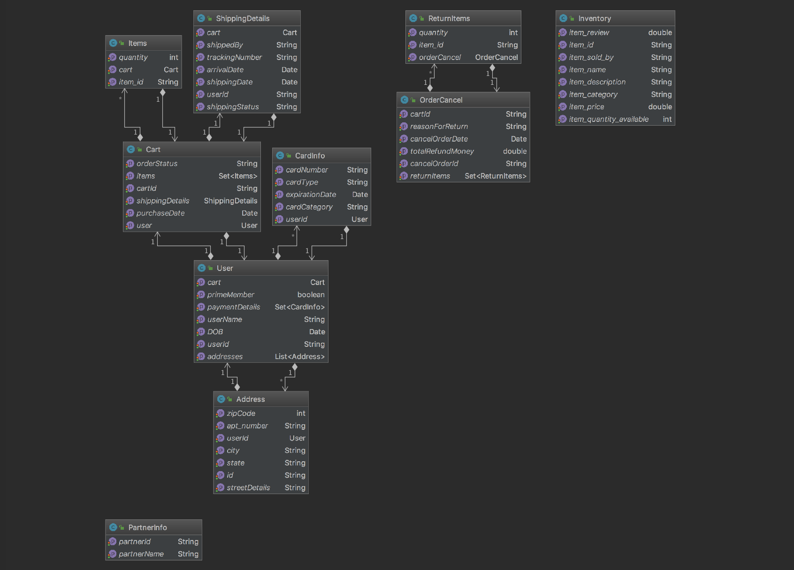
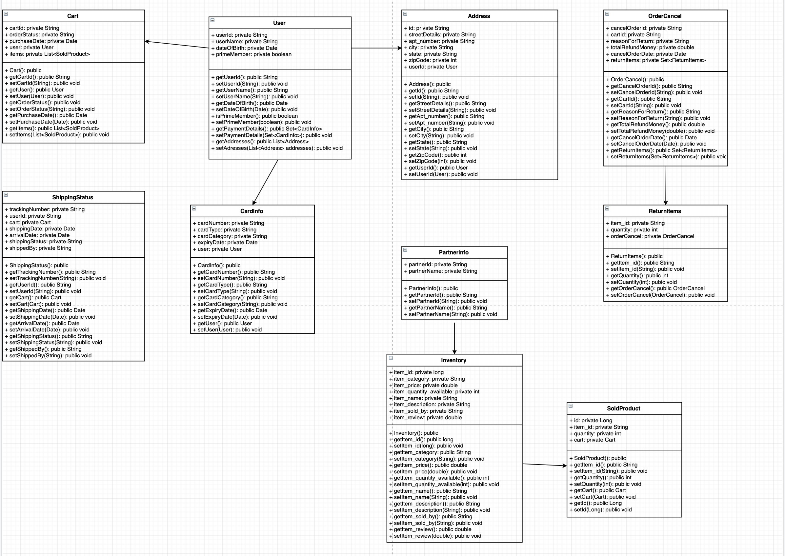
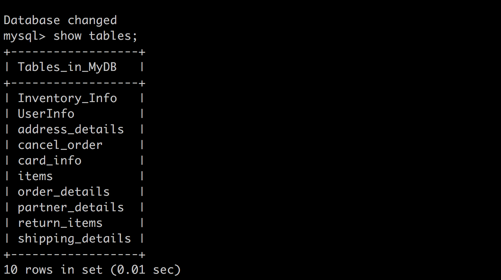

# comp433-ecommerce
<b>This project used both Apache cxf and Spring.</b>

# UML - Class Diagram
<b>Our UML Model shown below features classes that include information on various aspects of the web service, such as the Users, the Items, and the Partner from which the items come from. Our main source of inspiration when creating this model was in strong relation to Amazon.</b>
 

<b>Note: UML Model expected to expand in complexity as our group progesses through the projects moving forward.</b>

Users: personal information, payment information, address, status of membership, access to adding/deleting from their cart

Cart: items, shipping details, purchase date

Partner: id, name

Inventory: items

Additionally, we have added classes to cover the scenario of an item being returned or an order being canceled.

# Updated UML

# Tables

# Configuration details

1. CXF configuration are at /webapp/WEB_INF/apache-cxf-services.xml
2. Spring configuration is at /webapp/WEB_INF/ApplicationContext.xml
3. DataSource configuration is done in ApplicationContext.xml
4. Hibernate ORM is used for db connectivity and data modeling

