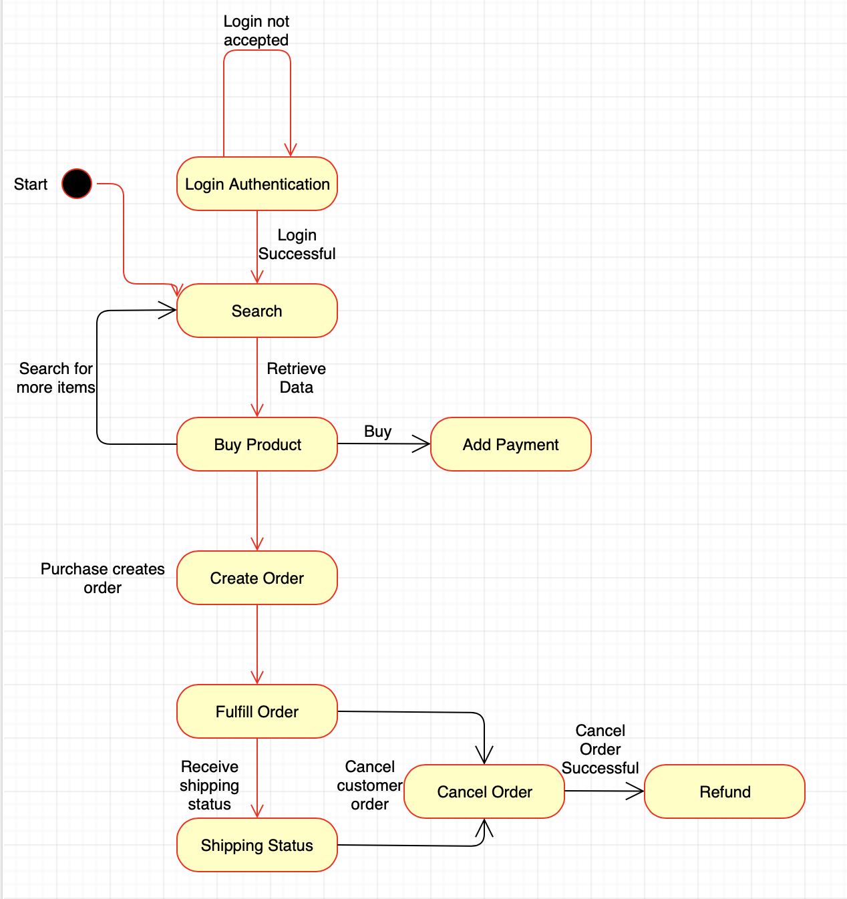

# comp433-ecommerce
<b>This project used both Apache cxf and Spring.</b>

# UML - Class Diagram
<b>Our UML Model shown below features classes that include information on various aspects of the web service, such as the Users, the Items, and the Partner from which the items come from. Our main source of inspiration when creating this model was in strong relation to Amazon.</b>
</br>

<b>Note: UML Model expected to expand in complexity as our group progesses through the projects moving forward.</b>
<p>Users: personal information, payment information, address, status of membership, access to adding/deleting from their cart</p>
<p>Cart: items, shipping details, purchase date</p>
<p>Partner: id, name</p>
<p>Inventory: items</p>
<p>Additionally, we have added classes to cover the scenario of an item being returned or an order being canceled.</p>


# Updated UML


# Tables


# State Diagram



# API Documentation
**API Reference Contents**
<b>Customer_POST</b>
 - Updates a customer in the database, but can also be used to create the customer if said customer is not already in the database.
   
   <b>Resource URL</b>
   <p>http://localhost:8080/services/userdata/users</p>
   <b>Example Request</b>
   <p>POST http://localhost:8080/services/userdata/users</p>
       <b>Example Body</b>
```
   { 
   "userData":{ 
      "userName":"Shailendra",
      "dateOfBirth":"2012-04-23T18:25:43.511Z",
      "primeMember":true,
      "paymentDetails":[ 
         { 
            "cardNumber":"74959454960",
            "cardType":"CREDIT",
            "cardCategory":"VISA",
            "expiryDate":"2020-04-23"
         }
      ]
   }
}
```
   <b>Example Response</b>
```
  {
    "headers": {},
    "body": {
        "links": [
            {
                "action": "view",
                "url": "http://localhost:8080/services/userdata/users/1575849321320"
            }
        ],
        "userId": "1575849321320",
        "userName": "Shailendra",
        "dateOfBirth": 1335205543511,
        "primeMember": true
    },
    "statusCode": "CREATED"
  }
```
<b>Customer_GET</b>
 - Retrieves a customer's information.
   
   <b>Resource URL</b>
   <p>http://localhost:8080/services/userdata/users/1575945796575</p>
   <b>Example Request</b>
   <p>GET http://localhost:8080/services/userdata/users/1575945796575</p>
   <b>Example Response</b>
```
{
    "headers": {},
    "body": {
        "links": null,
        "userId": "1575945796575",
        "userName": "Shailendra",
        "dateOfBirth": 1335205544000,
        "primeMember": true
    },
    "statusCode": "ACCEPTED"
}
```
<b>Product_POST</b>
 - Creates/Updates a product in the database.
   
   <b>Resource URL</b>
   <p>http://localhost:8080/services/product/products</p>
   <b>Example Request</b>
   <p>POST http://localhost:8080/services/product/products</p>
     <b>Example Body</b>
```
{ 
   "products":[{ 
      "item_category":"Electronics",
      "item_price":27.5,
      "item_quantity_available":10,
      "item_name":"Hello Product",
      "item_description": "Electonics item",
      "item_sold_by": "Partner1",
      "item_review":3.5
   }]
}
```
   <b>Example Response</b>
```
{
    "headers": {},
    "body": "products added successfully",
    "statusCode": "CREATED"
}
```
<b>Product_GET</b>
 - Retrieves a product's information.
   
   <b>Resource URL</b>
   <p>http://localhost:8080/services/product/products/1</p>
   <b>Example Request</b>
   <p>GET http://localhost:8080/services/product/products/1</p>
   <b>Example Response</b>
```
{
    "headers": {},
    "body": {
        "links": [
            {
                "action": "buy",
                "url": "http://localhost:8080/services/order/orders"
            }
        ],
        "item_id": 1,
        "item_category": "Electronics",
        "item_price": 27.5,
        "item_quantity_available": 10,
        "item_review": 0.0
    },
    "statusCode": "ACCEPTED"
}
```
<b>Order_POST</b>
 - Creates/Updates an order in the database.
   
   <b>Resource URL</b>
   <p>http://localhost:8080/services/order/orders</p>
   <b>Example Request</b>
   <p>POST http://localhost:8080/services/order/orders</p>
     <b>Example Body</b>
```
{ 
   "orderDetails":{ 
      "purchaseDate":"2019-09-23T18:25:43.511Z",
      "orderStatus":"Order Placed",
      "items":[ 
         { 
            "item_id":"item 2",
            "quantity":2
         }
      ],
      "user":{ 
      	 "userId":"1575946565145"
         
      }
   },
   "paymentDetails": 
      { 
         "cardNumber":"74959454959",
         "cardType":"CREDIT",
         "cardCategory":"VISA",
         "expiryDate":"2020-04-23"
      }
   
}
```
   <b>Example Response</b>
```
{
    "headers": {},
    "body": {
        "links": [
            {
                "action": "order status",
                "url": "http://localhost:8080/services/order/orders/1575947108322"
            }
        ],
        "cartId": "1575947108322"
    },
    "statusCode": "CREATED"
}
```
<b>Order_GET</b>
 - Retrieves Order data from database.
   
   <b>Resource URL</b>
   <p>http://localhost:8080/services/order/orders/1575947108322</p>
   <b>Example Request</b>
   <p>GET http://localhost:8080/services/order/orders/1575947108322</p>
   <b>Example Response</b>
```
{
    "headers": {},
    "body": {
        "cartId": "1575947108322",
        "itemsSold": [
            {
                "item_id": "item 2",
                "quantity": 2
            }
        ],
        "orderStatus": "Order Placed"
    },
    "statusCode": "ACCEPTED"
}
```
<b>Ship_POST</b>
 - Creates a shipping status in the database for tracking delivery.
   
   <b>Resource URL</b>
   <p>http://localhost:8080/services/ship/shippingData</p>
   <b>Example Request</b>
   <p>POST http://localhost:8080/services/ship/shippingData/</p>
      <b>Example Body</b>
```
{ 
   "shippingDetails":{ 
      "shippingStatus":"shipped",
      "shippedBy":"USPS",
      "cart":{ 
      	 "cartId":"1575947108322"
         
      }
   }
}
```
   <b>Example Response</b>
```
{
    "headers": {},
    "body": {
        "links": [
            {
                "action": "ship_status",
                "url": "http://localhost:8080/services/ship/shippingData/15759483146621575947108322"
            }
        ],
        "trackingNumber": "15759483146621575947108322"
    },
    "statusCode": "CREATED"
}
```
<b>Ship_GET</b>
 - Retrieves the shipping status of an order from the database.
   
   <b>Resource URL</b>
   <p>http://localhost:8080/services/ship/shippingData/15720363515651572036341594</p>
   <b>Example Request</b>
   <p>GET http://localhost:8080/services/ship/shippingData/15720363515651572036341594</p>
   <b>Example Response</b>
```
{
    "headers": {},
    "body": "shipped",
    "statusCode": "ACCEPTED"
}
```
# Configuration details

1. CXF configuration are at /webapp/WEB_INF/apache-cxf-services.xml
2. Spring configuration is at /webapp/WEB_INF/ApplicationContext.xml
3. DataSource configuration is done in ApplicationContext.xml
4. Hibernate ORM is used for db connectivity and data modeling


